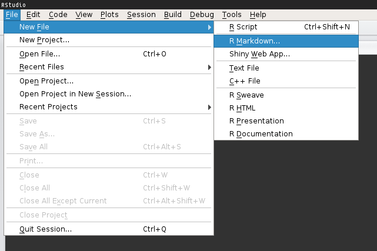
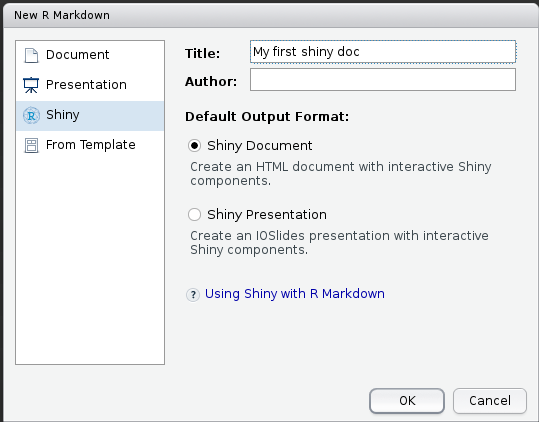
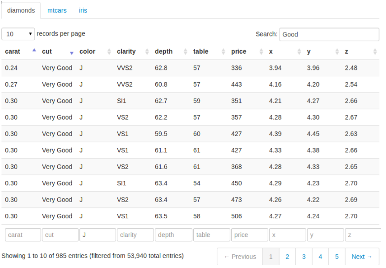
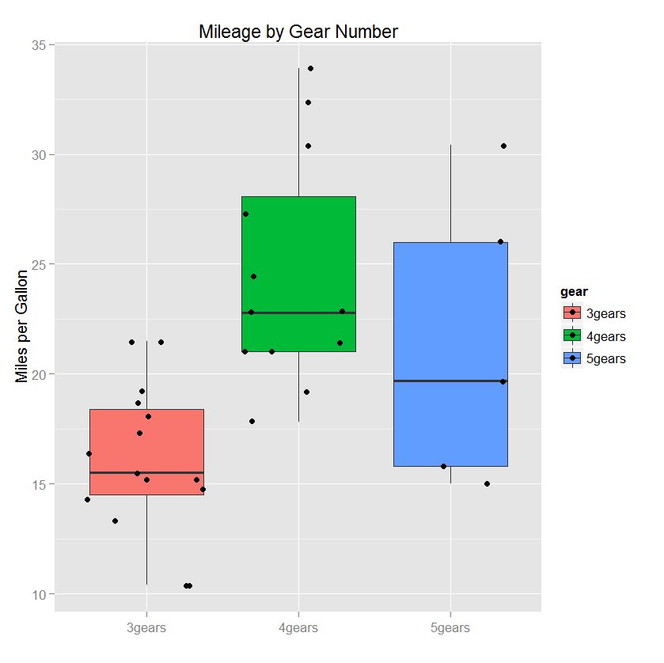
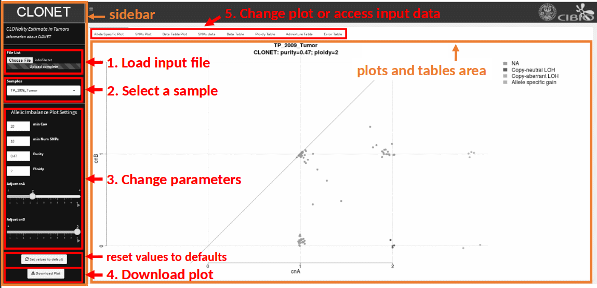

```{r setup, include=FALSE}
knitr::opts_chunk$set(echo = FALSE)
```

## R Markdown
"R Markdown is an authoring format that enables easy creation of dynamic documents, presentations, and reports from R. It combines the core
syntax of markdown with embedded R code chunks that are run so their output can be included in the final document."^1^

* __Markdown__
    + no HTML tags (ma è supportato)
* __R Markdown__
    + Markdown + R code chunks
    + Rmd -> md -> html(docx, pdf)
* __slides interattive__
    + ioslides, beamer
    + integrazione di Shiny apps
\

1. http://rmarkdown.rstudio.com/

## Esempio

L'utente può facilmente modificare __binning__ (istogramma) e __bandwidth__ (density function) e osservare immediatamente il 
risultato    

```{r eruptions, echo = FALSE}
library(shiny)

inputPanel(
  selectInput("n_breaks", label = "Number of bins:",
              choices = c(10, 20, 35, 50), selected = 20),
  
  sliderInput("bw_adjust", label = "Bandwidth adjustment:",
              min = 0.2, max = 2, value = 1, step = 0.2)
)

renderPlot({
  hist(faithful$eruptions, probability = TRUE, breaks = as.numeric(input$n_breaks),
       xlab = "Duration (minutes)", main = "Geyser eruption duration", col="gray60", border="gray60")
  
  dens <- density(faithful$eruptions, adjust = input$bw_adjust)
  lines(dens, col = "tomato3", lwd = 3)
}, height = "auto")

```

## Creare un documento Shiny interattivo
* __RStudio -> File -> Nuovo File -> R Markdown -> Shiny__     
    + Documento (HTML)    
    + Presentazione (ioslides)    

```{r, out.width = 450, fig.retina = NULL}
    

```

## Overview
* __YAML metadata__: opzioni documento
* __Markdown__: testo documento
* __R code chunk__: codice R eseguibile    

```{r, out.width = 700, fig.retina = NULL, fig.align = 'center'}
knitr::include_graphics("3.png")
```

## Inserire una Shiny app nel documento
* è possibile inserire una Shiny app completa all'interno di un documento interattivo   
    + definendo l'app __inline__, utilizzando la funzione *shinyApp*      
    + riferendosi ad una __directory esterna__ contentente l'app, utilizzando la funzione *shinyAppDir*     

## App inline
```{r, echo = TRUE, eval = FALSE}
shinyApp(
  
  ui = fluidPage(
    selectInput("region", "Region:", 
                choices = colnames(WorldPhones)),
    plotOutput("phonePlot")
  ),
  
  server = function(input, output) {
    output$phonePlot <- renderPlot({
      barplot(WorldPhones[,input$region]*1000, 
              ylab = "Number of Telephones", xlab = "Year")
    })
  },
  
  options = list(height = 200)
)
```

## App esterna
```{r, echo = TRUE, eval = FALSE}
shinyAppDir(
  system.file("Example/06_tabsets", package="shiny"),
  options=list(
    width="100%", height=700
  )
)
```

* controllo delle dimensioni dello spazio dedicato all'app
    + options = list(width = "100%", height = 200)
* (R Markdown): in entrambi gli esempi, sono stati usati gli attributi
    + *echo = TRUE*, per mostrare il codice
    + *eval = FALSE*, per impedire l'esecuzione del codice

## Deployment
* __Shiny Server__
    + http://docs.rstudio.com/shiny-server/

\


* __ShinyApps__
    + http://www.shinyapps.io/
    + shinyapps.io account + *rsconnect* 
        + *rsconnect::deployApp()* oppure *Publish* button in RStudio


## Advanced
* __shiny reactives__
    + espressioni reattive: i valori rispondono ai cambiamenti degli inputs
* __multiple pages__
    + link ad altri documenti interattivi, specificando il path relativo
* __delayed rendering__
    + generalmente un documento interattivo viene renderizzato ad ogni visualizzazione e non viene mostrato all'utente finchè
    il render è completo; problematico se documento pesante
    + *render_delayed* esegue il codice solo alla fine, dopo che il documento è stato caricato e mostrato all'utente          

##
* __migration__
    + ogni documento R Markdown che produce codice HTML può essere convertito in un documento interattivo
    + per convertire un documento esistente:
        + aggiungere *runtime: shiny* alla parte YAML
        + rendering con *rmarkdown::run* invece di *rmarkdown::render*             

# Tutorial

## 1. Input/output
* __Input__: control widgets
    + elementi web con i quali l'utente può interagire
    + molti widgets già pronti:
        + checkboxes, file input, radio buttons, sliders e molti altri
* i widgets raccolgono uno o più valori dall'utente 
    + quando l'utente modifica il widget, il valore cambia di conseguenza; ogni widget richiede un __nome__ e un'__etichetta__
* __Output__: plots, tabelle
* personalizzabili
    + aspetto (CSS)
    + azioni (javascript, HTML)
* http://shiny.rstudio.com/gallery/


## 1a. Esempio
```{r, echo = TRUE, eval = FALSE}
shinyApp(
  
  ui = fluidRow(
        checkboxGroupInput(inputId =  "checkGroup", 
                           label = "Checkbox group", 
                           choices = list("Choice1"=1, "Choice2"=2, "Choice3"=3), 
                           selected = 1),   
        
        verbatimTextOutput(outputId = "checkGroup")        
  ), 
  
  server = shinyServer(function(input, output) {
    output$checkGroup <- renderPrint({ input$checkGroup })
  })

  )
```

## 1b. Output
* _dataTable_
* _renderPlot_
* _renderImage_         

```{r, out.width = 400, fig.retina = NULL}
            

```

## 
* _dataTable_
    + crea tabelle HTML grazie alla libreria _jQuery_ __DataTables__
    + __ui.R__: _dataTableOutput(id = 'mytable')_
    + __server.R__: _output$mytable <- renderDataTable({ data })_
```{r, echo = TRUE, eval = FALSE}
runApp(list(
  ui = basicPage(
    dataTableOutput(outputId = 'mytable')),
  server = function(input, output) {
    output$mytable = renderDataTable({mtcars})
  }
))
```


## 
* _renderPlot_
    ```{r, echo = TRUE, eval = FALSE}
    shinyApp(
      ui = shinyUI(fluidPage(
        sidebarLayout(sidebarPanel(
          sliderInput(inputId = "bins", label = "Binning:",
                      min = 0, max = 10, value = 5, step = 0.5)),
    mainPanel(plotOutput(outputId = "myPlot"))
    ))),
      server = shinyServer(function(input, output) {
        output$myPlot <- renderPlot({
          hist(mtcars$cyl, breaks = input$bins)})
        })
    )  
      
    ```
    + limitazione: _renderPlot_ non invia qualsiasi immagine al browser; l'immagine deve essere generata da codice R, quindi altri
    metodi per generare immagini, come _writePNG()_ e _rgl.snapshot()_ non funzionano

##
* _renderImage_ 
    + ogni volta che viene eseguita crea un nuovo file immagine, salva il plot e infine ritorna una lista contenente
    nome del file e altri valori (_path_, _MIME_, _width_, _height_)
```{r, echo = TRUE, eval = FALSE}
shinyServer(function(input, output, session) {
  output$myImage <- renderImage({
    # file temp dove saldare l'output, verrà rimosso automaticamente
    outfile <- tempfile(fileext='.png')
    
    png(outfile, width=400, height=300)
    hist(hist(mtcars$cyl))
    dev.off()

    list(src = outfile,
         contentType = 'image/png',
         width = 400,
         height = 300)
  }, deleteFile = TRUE)
})
```

## 2. Reactivity
* 3 tipi di oggetti reattivi:
    + _reactive sources_
    + _reactive conductors_
    + _reactive endpoints_
* per costruire un'app reattiva minimale, sono sufficenti una _source_ e un _endpoint_
```{r, echo = TRUE, eval = FALSE}
shinyServer(function(input, output) {
  output$myPlot <- renderPlot({
    hist(rnorm(input$obs))
  })
})
```
* __output\$myPlot__ è il _reactive endpoint_, il quale usa la _reactive source_ __input\$obs__
* ogni volta che __input\$obs__ viene modificato, __output\$myPlot__ viene rieseguito

## 2a. Costruire un'app reattiva
* reattività: rieseguo il codice ogni volta che l'utente modifica un input
* per costruire un'app reattiva:
      1. aggiungere un oggetto R (_ui.R_)
      2. istruire Shiny su come costruire l'oggetto (_server.R_)
* l'oggetto sarà reattivo se il codice che lo costruisce chiama il valore di un widget

## 2b. Aggiungere un oggetto R alla ui
* Shiny fornisce numerose funzioni che convertono un oggetto R in output adatto alla ui. Ogni funzione produce un output specifico
* Posiziona la funzione di output nella sidebar (_sidebarPanel_) o nel pannello principale (_mainPanel_) 
```{r table, echo=FALSE, message=FALSE, warnings=FALSE, results='asis'}
tabl <- "
| Funzione di output  | Crea          |
|---------------------|:-------------:|
| htmlOutput          | HTML          |
| imageOutput         | immagini      |
| plotOutput          | plot          |
| tableOutput         | tabelle       |
| textOutput          | testo         |
"
cat(tabl) 
```

## 2c. Istruire Shiny
* ora dobbiamo specificare a Shiny come costruire l'oggetto 
* il codice va scritto in _server.R_, all'interno della funzione __unnamed__ in _shinyServer_
* la funzione funzione __unnamed__ svolge un ruolo speciale in Shiny
    + costruisce un oggetto _list-like_, chiamato __output__ che contiene tutto il codice necessario ad aggiornare l'oggetto R
    + ogni oggetto avrà la sua voce nella lista
    + si può creare una nuova voce definendo un nuovo elemento all'interno della funzione __unnamed__ 
        + il nome dell'elemento deve corrispondere a quello dell'elemento reattivo posizionato in _ui.R_

## Your turn!
Costruisci una piccola app che, utilizzando il dataset __mtcars__, restituisce in output un boxplot __mpg__ ("_Miles per gallon_") 
_vs_ una variabile scelta dall'utente

```{r, echo = FALSE, eval = TRUE}
mpgData <- mtcars
mpgData$am <- factor(mpgData$am, labels = c("Automatic", "Manual"))

shinyApp(
  
  ui = shinyUI(fluidPage(
    
    sidebarLayout(sidebarPanel(selectInput(inputId = "variable", 
                                           label = "Variabile:", choices = 
                                             list("Cylinders" = "cyl", 
                                                  "Transmission" = "am", "Gears" = "gear"))),
  
    mainPanel(plotOutput("mpgPlot")))
  
    )),
  
  server = shinyServer(function(input, output) {
    
    formulaText <- reactive({
    paste("mpg~", input$variable)
  })

  output$mpgPlot <- renderPlot({
    boxplot(as.formula(formulaText()), 
            data = mpgData, 
            varwidth = T, 
            col = sample(colors(), 5), 
            ylab = "mpg")
  })
  
  })
)
```

##
```{r, echo = TRUE, eval = FALSE}
mpgData <- mtcars
mpgData$am <- factor(mpgData$am, labels = c("Automatic", "Manual"))

shinyApp(
  
  ui = shinyUI(fluidPage(
    sidebarLayout(sidebarPanel(
      selectInput("variable", "Variabile:",list("Cylinders" = "cyl",
                                                "Transmission" = "am",
                                                "Gears" = "gear"))),
    mainPanel(plotOutput("mpgPlot")))
)),
  
  server = shinyServer(function(input, output) {
    formulaText <- reactive({ 
    paste("mpg~", input$variable)})
  output$mpgPlot <- renderPlot({
    boxplot(as.formula(formulaText()), 
            data = mpgData,
            col = sample(colors(), 5))})
  }))
```


## 3. Shinydashboard
* 3 componenti:
    + _header_
    + _sidebar_
    + _body_

```{r, echo = TRUE, eval = FALSE}
library(shiny)
library(shinydashboard)

ui <- dashboardPage(
  dashboardHeader(),
  dashboardSidebar(),
  dashboardBody()
)
server <- function(input, output) { }

shinyApp(ui, server)
```

## Your turn! 
```{r, echo = FALSE, eval = TRUE}
suppressPackageStartupMessages(library(shinydashboard))
suppressPackageStartupMessages(library(hexbin))

ui <- dashboardPage(
  dashboardHeader(title = "Beautiful dashboard"),
  dashboardSidebar(sliderInput(inputId = "bins", label = "Bins istogramma:", 
                               min = 1, max = 100, value = 51),
                   numericInput(inputId = "bandwidth", label = "Bandwidth density:",
                                min = 0.1, max = 1, value = 0.2),
                   sliderInput(inputId = "obs", label = "Numero osservazioni istogramma:", 
                               min = 1, max = 30, value = 16),
                   sliderInput(inputId = "hexbins", label = "Bins hexbin plot:", 
                               min = 1, max = 100, value = 18)),
        
  dashboardBody(fluidRow(
      box(plotOutput("plot1", height = 250)),
      box(plotOutput("plot2", height = 250))))
  )

server <- function(input, output) {
  output$plot1 <- renderPlot({
    hist(mtcars$mpg[1:input$obs], breaks = input$bins, freq = F, main = "Histogram", xlab = "x", col = "gray60")
    lines(density(mtcars$mpg[1:input$obs], bw = input$bandwidth), 
          col = "tomato3", lwd = 3)})
  output$plot2 <- renderPlot({
    plot(hexbin(rnorm(1000), rnorm(1000), xbins = input$hexbins), 
         main="Hexagonal Binning", xlab = "x", ylab = "y", legend = F,  
         colramp = BTY)})
}

shinyApp(ui, server)
```

##
```{r, echo = TRUE, eval = FALSE}
ui <- dashboardPage(
  dashboardHeader(title = "Beautiful dashboard"),
  dashboardSidebar(sliderInput(inputId = "bins", label = "Bins istogramma:", 
                               min = 1, max = 100, value = 51),
                   numericInput(inputId = "bandwidth", label = "Bandwidth density:",
                                min = 0.1, max = 1, value = 0.2),
                   sliderInput(inputId = "obs", label = "Numero osservazioni:", 
                               min = 1, max = 30, value = 16),
                   sliderInput(inputId = "hexbins", label = "Bins hex plot:", 
                               min = 1, max = 100, value = 18)),
  dashboardBody(fluidRow(
      box(plotOutput("plot1", height = 250)),
      box(plotOutput("plot2", height = 250)))))

server <- function(input, output) {
  output$plot1 <- renderPlot({
    hist(mtcars$mpg[1:input$obs], breaks = input$bins)
    lines(density(mtcars$mpg[1:input$obs], bw = input$bandwidth))})
  output$plot2 <- renderPlot({
    plot(hexbin(rnorm(1000), rnorm(1000), xbins = input$hexbins))})}
```

## Demo
```{r, out.width = 1000, fig.retina = NULL, fig.align = 'center'}

```
http://sci-kappa.unitn.it:3838/users/alessio.locallo/CLONETgui_v1_7_purple/

## Thanks!
```{r, out.width = 600, fig.retina = NULL, fig.align = 'center'}
knitr::include_graphics("thanks.gif")
```